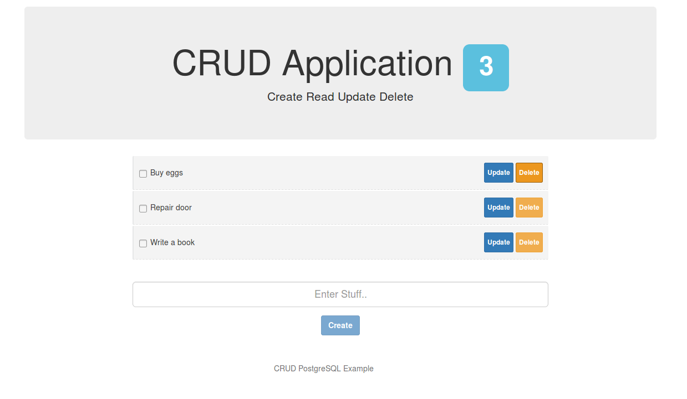

## Synopsis
 
A CRUD Todo App with PostgreSQL that uses $HTTP service with verbs post, get, put and delete.

- Built with NodeJS, ExpressJS, AngularJS and a PostgreSQL database

Node/Express provides the RESTful API through which the PostgreSQL database is queried. 

The program is mainly based on a Node Todo Tutorial on [scotch.io](http://scotch.io/tutorials/javascript/creating-a-single-page-todo-app-with-node-and-angular). The program makes use of [Brian Carlsons](https://github.com/brianc/node-postgres) PostgreSQL client for NodeJS. 

# Requirements

* Node
* PostgreSQL database running on port 5432. A database needs to be created 
* Sequelize will create the tables if none exists

## Installation

* Clone the Repository
* _npm install_ - install all the node packages listed in the package.json file 
* _bower install_ - installs the front end packages listed in the bower.json file
* Open ../server/config/database.js and enter PostgreSQL database connection details
* _node server.js_
* Browse to _http://localhost:3090_
* login demo info: oxxido@gmail.com:1234

## Technologies used
  
- [NodeJS](http://nodejs.org/)
- [ExpressJS](http://expressjs.com/)
- [AngularJS](https://angularjs.org/)
- [PostgreSQL](http://www.postgresql.org/)
- [Sequelize](http://sequelizejs.com)
- [node-postgre](https://github.com/brianc/node-postgres)
- [Bower](http://bower.io/)

## Screen Shot

		

Gerardo Rosciano
2017
